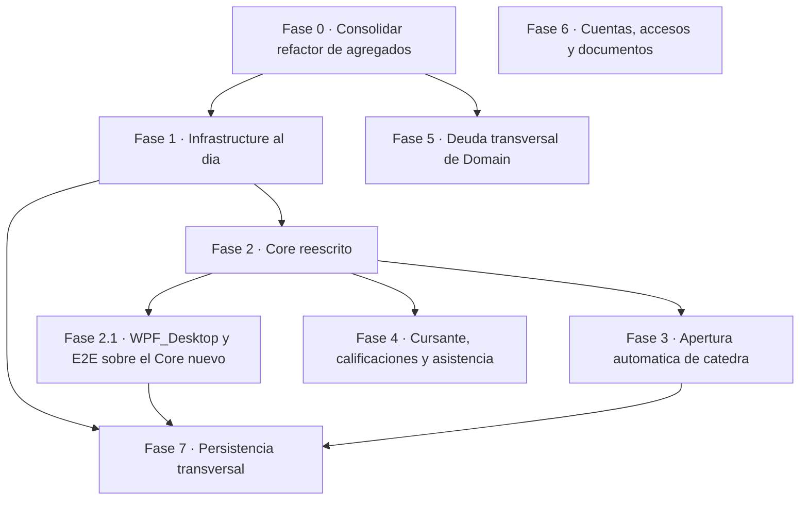

# Roadmap — EDUSIS

> Fecha: 2026-09-22; actualizado 2026-09-25 tras alinear las `EntityConfiguration` de EF Core con los agregados nuevos (commit `ff2de55`) y quitar la doble pertenencia de `Licencia` (commit `8073161`); actualizado 2026-09-26 tras cerrar la Fase 1 completa (contratos de repositorio, repositorios concretos, `UnitOfWork`, registro de MediatR y despacho en cascada, commits `b377fa5`…`0f39316`) salvo la migración de EF; actualizado 2026-09-28 tras cerrar la Fase 2 (cinco servicios nuevos de `Core` — `ServicioDivisiones`, `ServicioCursantes`, `ServicioAsistencias`, `ServicioMaterias`, `ServicioCatedras` — más el adelgazamiento de `ServicioCurso`/`ServicioCurricula`, commits `b3ac87b`…`76bc1d8`).
> Alcance: secuencia de trabajo a futuro, ordenada por dependencia técnica y de negocio, no por calendario. No describe el estado actual de la arquitectura (eso vive en `plan-implementacion.md`) ni el detalle de cada defecto puntual (eso vive en `todos.md`, con IDs `DOM-*`/`CORE-*`/`INFRA-*`/`UI-*`/`TEST-*`) — acá se agrupa ese trabajo en fases, con dependencias explícitas y un criterio de "listo" por fase.

## Cómo leer este documento

Cada fase indica: qué capas toca, qué habilita, qué la bloquea, cómo se sabe que terminó, y un tamaño relativo. El tamaño es cualitativo, no una estimación de tiempo — sale de contar tipos nuevos y capas involucradas, no de horas: **chico** = ajustes puntuales en pocos archivos existentes, sin tipos nuevos; **mediano** = uno o dos tipos nuevos (excepción, evento, método de repositorio) sin remapear EF; **grande** = agregado o repositorio nuevo, migración de EF, o cambio que atraviesa las cuatro capas.

Fuente: lectura directa de `Domain/`, `Core/`, `Infrastructure/`, `WPF_Desktop/` y `tests/` en la rama `002-fix-dominio`, cruzada con `docs/alcance-funcional.md` y `docs/revision-arquitectura.md`, más `git status`/`git log` al momento de escribir esto. Donde el código y `docs/plan/plan.md`/`docs/plan/tasks.md` difieren, se siguió el código: esos dos documentos describen un diseño intermedio (`SituacionRevista` como agregado raíz propio) que quedó superado por el diseño de `Catedra` (materia + división) ya escrito en el working tree.

## Mapa de dependencias

`F5` corre en paralelo a `F1`/`F2`: toca otros agregados (`Docente`, `Licencia`, `Alumno`, el kernel compartido) y no comparte archivos con lo que `F1`/`F2` reescriben. `F4` y `F6` incluyen tareas de `WPF_Desktop` que no pueden arrancar hasta que el caso de uso de `Core` del que dependen exista. `F2_1` (Fase 2.1) se intercala entre `F2` y `F3`/`F4` porque es la que de verdad habilita observar esos casos de uso desde la UI, y además desbloquea el punto abierto que le queda a `F1` (la migración de EF, ver su sección) sin formar un ciclo: `F1` ya cerró todo lo demás antes de que `F2`/`F2_1` existieran.

---

## Fase 0 — Consolidar el refactor de agregados que ya está en el working tree

**Qué es.** La rama `002-fix-dominio` ya reescribió `Domain` (commiteado el 2026-09-23, commits `db14e72`…`fbde3d0`): `Curso` quedó como catálogo liviano (`NivelEducativo` + `Grado`, sin `_divisiones`), `Division`/`Cursante`/`Materia`/`Catedra`/`PlanillaAsistencia` pasaron a ser agregados independientes, `Catedra` (materia + división) absorbió a `SituacionRevista` como entidad interna, `Cursante` es dueño de las calificaciones (entidad `Calificacion`) y la asistencia diaria vive en `PlanillaAsistencia` (división + fecha). `dotnet build Domain/Domain.csproj` ya compila limpio con este diseño. Esto reemplaza lo que describen `docs/plan/plan.md` y `docs/plan/tasks.md` (todavía hablan de `SituacionRevista` como agregado raíz propio) — quedaron desactualizados por una decisión de diseño posterior; no seguirlos al pie de la letra en las fases siguientes.

**Por qué va primero.** Es la base de todo lo demás: mientras no esté consolidada, cualquier trabajo en `Infrastructure`/`Core` apunta a un blanco móvil.

**Capas.** Domain (ya escrito), housekeeping de repositorio.

**Habilita.** Las fases 1 a 7 completas.

**Bloqueada por.** Nada — es el punto de partida.

**Trabajo pendiente.**
- ~~Comitear el refactor ya escrito (confirmando antes que compila limpio, como hoy).~~ Hecho — está comiteado y `dotnet build Domain/Domain.csproj` sigue en 0 errores/0 warnings, verificado el 2026-09-25.
- ~~Resolver la colisión `tests/` vs `Tests/` (`TEST-05`)~~: resuelto en el commit `5801b74` (`build(tests): agregar EDUSIS.TestSupport.Domain a la solución`) — `EDUSIS.sln` y `tests/run-tests.sh` pasaron a referenciar `Tests\`/`Tests/`, como figura la carpeta en disco. Verificado: `EDUSIS.sln` ya no tiene ninguna referencia a `tests\` en minúscula.
- ~~Verificar que las excepciones movidas a `Domain/Catedras/Exceptions/` y `Domain/Cursantes/Calificaciones/Exceptions/` no dejaron `using` huérfanos ni carpetas vacías en `Domain/Curriculas/Exceptions/`~~: verificado el 2026-09-25 — ninguna carpeta `Exceptions/` de `Domain` está vacía y el build no reporta `using` sin resolver.

**Listo cuando.** El refactor está comiteado, `Domain` compila limpio, y no quedan dos carpetas de test con el mismo nombre en distinto casing en el índice de git. **Cumplido — Fase 0 cerrada al 2026-09-25.**

**Tamaño.** Chico — es consolidar trabajo ya escrito, no diseño nuevo.

---

## Fase 1 — Alinear Infrastructure con los agregados nuevos

**Qué es.** ~~`Domain/Shared/IUnitOfWork.cs` ya declara `Divisiones`, `Cursantes`, `Materias`, `Catedras` y `PlanillasAsistencia`, pero `Infrastructure/UnitOfWork.cs` sólo implementa...~~ **Actualización 2026-09-25 (commit `ff2de55`):** el remapeo de EF ya se hizo — `EdusisDBContext` tiene `DbSet` para los cinco agregados nuevos, y las `EntityConfiguration` (`DivisionesConfiguration`, `CursantesConfiguration`, `CatedrasConfiguration`, `MateriasConfiguration`, `PlanillasAsistenciaConfiguration`, más las entidades internas `SituacionRevistaConfiguration`, `CalificacionesConfiguration`, `RegistrosAsistenciaConfiguration`) ya reflejan el modelo vigente: `Division` con tabla propia (FK a `Curso` sin navegación), `Cursante` con FK simple a `Alumno` y a `Division`, `Catedra` con `Horario` y `SituacionRevista` como colecciones internas (FK sombra + cascada), `CicloLectivo` como catálogo shared-type sin clase de dominio. **Actualización 2026-09-26 (commits `b377fa5`/`3cf17b7`/`527b1ba`/`d7f6b44`):** la capa de acceso también está — `Infrastructure/UnitOfWork.cs` implementa las once propiedades de `IUnitOfWork`, con un repositorio concreto por cada una en `Infrastructure/Repository/`. Lo único que sigue abierto de esta fase es la migración.

**Por qué va acá.** Es el primer punto donde el refactor de dominio se vuelve ejecutable: sin estos repositorios, `Core` no tiene forma de persistir los agregados nuevos.

**Capas.** Infrastructure.

**Habilita.** Fase 2 (necesita los repos para reescribir los servicios) y, de paso, que el registro de MediatR (prerrequisito de la Fase 3) tenga sentido.

**Bloqueada por.** Fase 0.

**Trabajo pendiente.**
- ~~Repositorios nuevos: `DivisionRepository`, `CursanteRepository`, `MateriaRepository`, `CatedraRepository`, `PlanillaAsistenciaRepository`...~~ **Hecho en `527b1ba` (2026-09-26)**, con los métodos que ya definían las interfaces de `Domain`.
- ~~Completar `UnitOfWork.cs` con las cinco propiedades nuevas...~~ **Hecho en `527b1ba`**, junto con la validación del ciclo de transacción (no permite abrir una segunda; libera la transacción en `Dispose()`).
- ~~Reescribir las `EntityConfiguration` de estos agregados~~: hecho en el commit `ff2de55` (2026-09-25) — ver nota de "Qué es" arriba. El diseño final difiere del previsto acá en un punto: `CicloLectivo` no quedó como `OwnsOne` simple sino como VO (`OwnsOne` en `Cursante`) más un catálogo `SharedTypeEntity` (`CicloLectivoConfiguration.ConfigurarCatalogoCicloLectivo`) que restringe el período por FK contra una tabla `ciclo_lectivo` con los años 2020–2035 precargados (`HasData`).
- Regenerar la migración EF reflejando lo anterior (sólo se puede correr desde Windows, y sólo una vez que `Core` compile porque el *startup project* de la migración es `WPF_Desktop`). **Sigue pendiente y es ahora el único punto abierto de esta fase**: sigue existiendo una sola migración (`20250519233424_InitCreate`), previa a todo el remapeo de `ff2de55` y a los repositorios de `b377fa5`…`0f39316` — la distancia entre el modelo mapeado/consumido y el esquema real de BD siguió creciendo. Cierra H-023. **Actualización 2026-09-28 (cierre de la Fase 2, `76bc1d8`)**: este punto se **desbloqueó parcialmente**, no del todo. La condición que faltaba era que `Core` compilara, y ya compila (0 errores). Pero el *startup project* de la migración sigue siendo `WPF_Desktop`, y `WPF_Desktop` todavía no compila por UI-09 (`MC3066` en `GestionSituacionRevistaView.xaml:25`, ver Fase 2.1). La migración sigue bloqueada, pero cambió de causa: ya no es `Core`, ahora es UI-09. **Actualización 2026-10-03**: `WPF_Desktop` ya compila (UI-09 cerrado, `EDUSIS.sln` en 0 errores), así que el bloqueo por compilación **desapareció**. Lo que bloquea ahora es la base de datos: no está instalada, y sin ella no se puede generar la migración ni recorrer la app. H-023 sigue abierto.
- Agregar los `UNIQUE` de apoyo que sostienen los invariantes que dejaron de protegerse en memoria al partir agregados. **Parcialmente hecho en `ff2de55`**: ya existen `HasIndex(...).IsUnique()` para `(materia_id, division_id)` en `Catedra`, `(curricula_id, descripcion)` en `Materia`, `(division_id, fecha)` en `PlanillaAsistencia` y `(planilla_asistencia_id, cursante_id)` en `RegistroAsistencia`. **Siguen faltando**: `(curso_id, descripcion)` en `Division`, `docente_id` filtrado por preceptor en `Division`, y `(alumno_id, ciclo_lectivo)` en `Cursante` — verificado por lectura de `DivisionesConfiguration.cs` y `CursantesConfiguration.cs`, ninguna de las tres declara `HasIndex`. Sin cambios al 2026-09-26.
- ~~Arreglar el registro de MediatR...~~ **Hecho en `d7f6b44` (2026-09-26)**: `InfrastructureDI` escanea también el assembly de `Core`. Es condición previa de cualquier trabajo basado en eventos de dominio (Fase 3) y ya está cumplida.
- ~~**Hallazgo nuevo (2026-09-25)**: `Infrastructure/Repository/CurriculaRepository.cs` no compila...~~ **Resuelto en `3cf17b7` (2026-09-26)**: `BuscarCurriculaAsync`/`CurriculasSegunCursoAsync` se reescribieron contra `Curricula` reducido, sin `Include`.

**Listo cuando.** `dotnet build Infrastructure/Infrastructure.csproj` compila limpio, la migración nueva existe y es aplicable, y un handler de `Core` (aunque todavía no haga nada) queda efectivamente registrado en el contenedor DI. **Parcialmente cumplido al 2026-09-26**: `dotnet build Infrastructure/Infrastructure.csproj` en la solución sigue fallando porque arrastra a `Core` transitivamente, pero `Infrastructure` compila limpio de forma aislada (0 errores/0 advertencias, verificado con un arnés que compila `Infrastructure/**/*.cs` — salvo `InfrastructureDI.cs`/`Documentos/`, que dependen de `Core` — contra sólo `Domain`) y el registro de MediatR ya escanea `Core`. ~~**No cumplido**: la migración nueva todavía no existe — requiere que `Core` compile primero (el *startup project* es `WPF_Desktop`).~~ **Actualización 2026-09-28**: la precondición de `Core` ya se cumplió (`Core` compila con 0 errores desde `76bc1d8`, Fase 2 cerrada), pero la migración sigue sin existir porque `WPF_Desktop` — el *startup project* real de `dotnet ef` — todavía no compila (UI-09). Sigue **no cumplido**, ahora por una causa distinta; ver Fase 2.1.

**Tamaño.** ~~Grande~~ — cerrada salvo la migración, que ya no está bloqueada por la Fase 2 (`Core`, cerrada) sino por UI-09 dentro de la Fase 2.1.

---

## Fase 2 — Reescribir Core sobre los agregados nuevos

> **Actualización 2026-09-28 (commits `b3ac87b`…`76bc1d8`). Fase cerrada.** `dotnet build Core/Core.csproj` compila con 0 errores (verificado dentro de `dotnet build EDUSIS.sln --no-incremental`). El bloque construyó cinco servicios nuevos, uno por raíz de agregado — `Core/ServicioDivisiones`, `Core/ServicioCursantes`, `Core/ServicioAsistencias`, `Core/ServicioMaterias`, `Core/ServicioCatedras` — y adelgazó `ServicioCurso`/`ServicioCurricula` a los tres casos de uso que de verdad les corresponden a `Curso`/`Curricula`. La decisión abierta que esta fase dejaba planteada (¿`Materia`/`Catedra` viven dentro de `ServicioCurriculas` o tienen servicio propio?) se resolvió por la segunda opción, ver detalle más abajo y en "Decisiones abiertas".

**Qué es.** `Core/ServicioCursos/ServicioCurso.cs` todavía llama a `Curso.AgregarDivision()`, `ICursoRepository.CursoConDivisiones()` y `Curso.AgregarAlumnoEnDivision()` — ninguno existe ya en `Domain` tras la Fase 0. `Core/ServicioCurriculas/ServicioCurricula.cs` llama a `Curricula.AgregarMateria()`, también eliminado. `Core/ServicioCurriculas/Events/MateriaEliminadaEventHandler.cs` tiene además dos problemas propios: importa el namespace viejo `Domain.Cursos.DomainEvents` (el evento se movió a `Domain.Materias.DomainEvents`) y depende de `ICurriculaRepository` para buscar y eliminar una `Materia`, cuando `Materia` ya tiene su propio repositorio.

**Por qué va acá.** Es la contraparte de la Fase 1 en la capa de aplicación: sin esto, ningún caso de uso de currícula, materia, división o cursante funciona, aunque `Domain` e `Infrastructure` ya estén al día.

**Capas.** Core (y los DTOs que asumen la forma vieja de estos agregados).

**Habilita.** Fase 2.1, Fase 3 y Fase 4.

**Bloqueada por.** Fase 1.

**Caveat de verificación.** ~~Hoy `dotnet build Core/Core.csproj` reporta sólo 4 errores (verificado 2026-09-26, sin cambios desde que se escribió este documento): tres en `MateriaEliminadaEventHandler.cs` (el `using` roto y el tipo de evento que no resuelve, ×2) y uno en `Core/ServicioCursos/DTOs/Responses/CursoResponse.cs` por `NivelEducativo` sin `using` — pese a que `ServicioCurso.cs` tiene código vivo (fuera del bloque comentado) que llama a miembros que no existen en `Domain`. El compilador resuelve primero los errores de esa etapa de declaración antes de bajar a analizar cuerpos de método, así que mientras esos `using` sigan rotos no llega a emitir los errores de `ServicioCurso.cs`/`ServicioCurricula.cs`. Apenas se corrijan, el conteo de errores va a subir de golpe (`docs/todos.md`, nota de cabecera, cuantifica ~20 más). No dimensionar esta fase por el número de errores visible hoy — el inventario real es el de llamadas rotas descripto en "Qué es", no la salida actual de `dotnet build`.~~ **[CONFIRMADO Y CERRADO] al 2026-09-28.** El pronóstico se cumplió al pie de la letra: al corregir esos `using` rotos el conteo de errores subió de golpe, y ese lote más grande terminó de resolverse — `Core` compila hoy con 0 errores. El fenómeno de enmascaramiento (un error de una etapa temprana del compilador tapa los de las etapas siguientes) no desapareció, se corrió una etapa más arriba: el único error que le queda a toda la solución es `MC3066` en `WPF_Desktop` (**UI-09**, `GestionSituacionRevistaView.xaml:25`, no encuentra el tipo público `Cargo`), que es un error de *markup compile* de XAML — una etapa que corre **antes** que el compilador de C#. Por eso los ~41 sitios de llamada rotos que este documento predecía en 6 archivos de `WPF_Desktop` (ver Fase 2.1) siguen sin poder confirmarse: el proyecto aborta antes de llegar a compilar C#. **Caveat operativo nuevo, para no repetir el error de medición de esta fase**: un `dotnet build WPF_Desktop/WPF_Desktop.csproj` **incremental** devuelve `0 Errores` de forma falsa, porque el paso de XAML queda cacheado como válido de una corrida anterior — toda afirmación sobre el estado de build de un proyecto WPF exige `--no-incremental`.

**Trabajo pendiente.**
- ~~Reescribir `ServicioCurso` (usa `IUnitOfWork.Divisiones`/`Cursantes` en vez de navegar `Curso`) y `ServicioCurricula` (usa `IUnitOfWork.Materias`/`Catedras`). Decisión abierta: si `Materia` y `Catedra` son agregados propios, probablemente cada uno necesita su propio `ServicioMaterias`/`ServicioCatedras` en vez de vivir dentro de `ServicioCurriculas` — no se resuelve en este roadmap, es la primera decisión de diseño a tomar al empezar esta fase.~~ **[RESUELTO] en `b3ac87b`…`76bc1d8`**: `IServicioCurso` quedó con tres casos de uso (`ListarCursosAsync`, `RegistrarCurso`, `EliminarCurso`); `IServicioCurricula` quedó con tres (`ListarCurriculasSegunCursoAsync`, `RegistrarCurriculaAsync`, `DesafectarCurriculaAsync`). La decisión abierta se resolvió por la segunda opción: un servicio propio por raíz de agregado, no uno compartido — se crearon `Core/ServicioDivisiones`, `Core/ServicioCursantes`, `Core/ServicioMaterias`, `Core/ServicioCatedras` y, de yapa, `Core/ServicioAsistencias` (el mismo criterio aplicado a `PlanillaAsistencia`). `Core/` pasó a tener 14 carpetas de servicio, las 14 registradas como `Scoped` en `Core/Shared/CoreDI.cs`.
- ~~Corregir `MateriaEliminadaEventHandler.cs`: cambiar el `using` al namespace correcto y el repositorio inyectado a `IMateriaRepository`. Alcance mínimo acá es que compile y no rompa nada — la lógica real de bloqueo de baja (si hay cátedras con designaciones vigentes) es trabajo de la Fase 3.~~ **[RESUELTO]**: el handler se movió a `Core/ServicioCatedras/Events/MateriaEliminadaEventHandler.cs`, con el `using` corregido y `IMateriaRepository` inyectado en vez de `ICurriculaRepository`. La lógica real de bloqueo de baja sigue siendo trabajo de la Fase 3, como estaba previsto.
- ~~Excepciones nuevas de `Core` para los invariantes que ahora se resuelven con consulta al repositorio (siguiendo el precedente de `CursoDuplicadoException`, que ya existe en `Core/ServicioCursos/Exceptions/`): inscripción duplicada de cursante, preceptor ya asignado, nombre de materia duplicado en la currícula, superposición horaria de un docente.~~ **[RESUELTO]**: `Core` tiene hoy once excepciones en total; `CursoDuplicadoException` es la única preexistente, las otras diez son de esta fase — `InscripcionDuplicadaException` (`ServicioCursantes`), `DivisionDuplicadaException`/`PreceptorAsignadoException` (`ServicioDivisiones`), `NombreMateriaDuplicadoException`/`LimiteEspaciosCurricularesException`/`LimiteHorasSemanalesException` (`ServicioMaterias`), `CatedraDuplicadaException`/`ColisionHorariaEnDivisionException`/`DocenteEnDosAulasException` (`ServicioCatedras`) y `PlanillaDuplicadaException` (`ServicioAsistencias`).
- ~~Actualizar los DTOs de `ServicioCursos`/`ServicioCurriculas` que asumen la forma vieja (p. ej. `RegistrarCursanteRequest`).~~ **[RESUELTO]**: `RegistrarCursanteRequest` y el resto de los DTOs de cursante viven ahora en `Core/ServicioCursantes/DTOs/`; `CursoResponse` perdió los conteos `Divisiones`/`Alumnos` que `ServicioCurso` ya no calcula. Efecto colateral esperado, no defecto nuevo: eso es justo lo que dejó sin compilar a `EDUSIS.EndToEndTests` (**TEST-07**, ver Fase 2.1).

**Listo cuando.** `dotnet build Core/Core.csproj` compila limpio y los casos de uso de curso/división/currícula/materia de `alcance-funcional.md` vuelven a tener una ruta de código completa (no necesariamente conectada a la UI todavía — eso es Fase 4/6). **Cumplido — Fase 2 cerrada al 2026-09-28 (commits `b3ac87b`…`76bc1d8`)**: `Core` compila con 0 errores y los casos de uso de curso/división/currícula/materia/cátedra/cursante/asistencia tienen ruta de código completa en `Core`. Sigue sin estar conectado a la UI — eso pasa a la Fase 2.1 (bloqueo UI-09) y a lo que queda de la Fase 4.

**Tamaño.** Grande — cumplido: dos servicios adelgazados, cinco servicios nuevos (uno por raíz de agregado) y la decisión de estructura de servicios resuelta.

---

## Fase 2.1 — Adaptar WPF_Desktop y EDUSIS.EndToEndTests al Core nuevo

> **Estado al 2026-10-03 — compila y las pruebas pasan; la verificación funcional sigue PENDIENTE, y la fase NO está cerrada.** Se ejecutó con [`plan/wpf-desktop.md`](plan/wpf-desktop.md) y su disección [`plan/wpf-desktop-tasks.md`](plan/wpf-desktop-tasks.md) (42 commits sobre `f4f57fb`, `dd89f93`…`e8d5043`). Criterio alcanzado: **builds + pruebas + guardas**. `dotnet build WPF_Desktop/WPF_Desktop.csproj --no-incremental` → 0 errores; `dotnet build EDUSIS.sln --no-incremental` → 0 errores; `dotnet test tests/WPF_Desktop.UnitTests` → 320 pruebas, 320 pasan, 0 omitidas; `./tests/run-tests.sh --rapidas` sin regresiones (`Domain` 303/308, `Core` 191/192, las omitidas son preexistentes). Secuencia de errores de la tanda: `1` → `18` → `40` → `32` → `25` → `20` → `1` → `0`. Advertencias de `WPF_Desktop`: 328 (línea base real de W1) → 282; `CS4014` de 7 a 1.
>
> **Lo que sigue abierto, sin ambigüedad.** El propio plan dice que "el build verde no cierra la tarea" y que la **verificación funcional en Windows** es "lo único que cierra la tarea de verdad". Esa verificación **no se hizo**: requiere la base de datos, que no está instalada (**H-023**: la migración sigue siendo sólo `InitCreate` y no refleja el mapeo de `ff2de55`). Los cinco flujos de los pasos 1 a 5 (migración, divisiones, diseño curricular, cátedras y situación de revista, cursantes y calificaciones) están **sin ejecutar**, incluido el paso 0 (arranque de la app y navegación inicial), que es el que verifica la corrección del composition root. Que algo figure como `[RESUELTO]` en `docs/todos.md` significa que el código lo respalda por lectura, pruebas y guardas, no que se haya recorrido en la app corriendo. Deuda registrada al cerrar: UI-17…UI-37 y los items 23…27 de violaciones, entre ellos el `DbContext` único de vida de aplicación (UI-18), los servicios sin pantalla (UI-19) y `CLAUDE.md` desactualizado (UI-30).

**Qué es.** El trabajo que sigue inmediatamente después de cerrar la Fase 2: `WPF_Desktop` y `EDUSIS.EndToEndTests` todavía están programados contra la forma vieja de `Core` (la que existía antes de `b3ac87b`…`76bc1d8`), y hoy son los dos únicos proyectos de la solución que no compilan. `WPF_Desktop` tiene un solo error, **UI-09** (`MC3066` en `WPF_Desktop/Views/Cursos/Curriculas/Materias/SituacionRevista/GestionSituacionRevistaView.xaml:25`, no encuentra el tipo público `Cargo`), pero por ser un error de *markup compile* de XAML — etapa previa al compilador de C# — enmascara todo lo demás: el proyecto aborta antes de llegar a compilar los ViewModels, así que los ~41 sitios de llamada rotos que `docs/plan/core.md` predijo en 6 archivos (`GestionCurriculasViewModel.cs` 20, `GestionSituacionRevistaViewModel.cs` 10, `GestionDivisionesViewModel.cs` 5, `GestionCursantesViewModel.cs` 2, `GestionDocentesViewModel.cs` 1, `GestionCurriculasView.xaml` 3) siguen sin poder confirmarse. `EDUSIS.EndToEndTests` tiene un problema más chico y ya diagnosticado, **TEST-07**: 6 `CS1061` en 2 archivos, consecuencia esperada del adelgazamiento de `ServicioCurso` (`CursoResponse.Divisiones`, `IServicioCurso.AgregarDivisionAlCurso` ×2, `IServicioCurso.BuscarDivisionesAsync`, `CursoBuilder.ConDivision`).

**Por qué va acá.** Es la contraparte de UI y de pruebas de punta a punta de la Fase 2: mientras esto no se resuelva, ningún caso de uso nuevo de `Core` (divisiones, cursantes, calificaciones, asistencias, materias, cátedras) es alcanzable desde una pantalla ni verificable con una prueba E2E, aunque la capa de aplicación ya los tenga completos.

**Capas.** WPF_Desktop, `Tests/EDUSIS.EndToEndTests`.

**Habilita.** La migración de EF (H-023, el único punto que le queda abierto a la Fase 1 — ver su sección) y el primer build verde de `EDUSIS.sln` en su conjunto.

**Bloqueada por.** Fase 2 (cerrada, `76bc1d8`).

**Trabajo pendiente.**
- Resolver UI-09 primero: es el bloqueante que enmascara todo lo demás en `WPF_Desktop`. Encontrar de dónde debería resolverse el tipo público `Cargo` que pide `GestionSituacionRevistaView.xaml:25` (probablemente un enum o clase que se movió o se renombró en el refactor de `Catedra`/`SituacionRevista`) y corregir la referencia de XAML. **[HECHO 2026-10-03]** `cae617f` (W1.A): era el `xmlns` de la línea 9, y `Cargo` vive hoy en `Domain.Catedras.SituacionesRevista`.
- Con UI-09 resuelto, confirmar y corregir los ~41 sitios de llamada rotos en los 6 archivos listados en "Qué es" — recién ahí el compilador de C# llega a evaluarlos. Es trabajo de adaptar cada ViewModel a la forma nueva de los servicios (`ServicioDivisiones`, `ServicioCursantes`, `ServicioMaterias`, `ServicioCatedras`, `ServicioAsistencias` en vez de los métodos que tenían `ServicioCurso`/`ServicioCurricula`). **[HECHO 2026-10-03]** pero no eran ~41 ni estaban repartidos así: el compilador imprimió 18 errores de declaración y 40 de cuerpos de método (seis eran tipos que `Core` **eliminó**, no mudó), ver la corrección en `plan/core.md`. Cerrados en W1 a W6, `4b7165b` (build verde).
- TEST-07: actualizar `RegistroDeCursoConDivisionesTests.cs` y `ColeccionE2E.cs` para que dejen de usar `CursoResponse.Divisiones`, `IServicioCurso.AgregarDivisionAlCurso`, `IServicioCurso.BuscarDivisionesAsync` y `CursoBuilder.ConDivision` — el reemplazo natural es ejercitar `ServicioDivisiones`/`ServicioCursantes` directamente, ya que esos casos de uso salieron de `ServicioCurso`. **[HECHO 2026-10-02]** `dd89f93` (W0.T). La prueba E2E no se ejecuta sin Docker ni `EDUSIS_TEST_SQLSERVER`, que es el resultado correcto.

**Listo cuando.** `dotnet build EDUSIS.sln --no-incremental` compila con 0 errores en los diez proyectos (los cuatro de producción — `Domain`/`Core`/`Infrastructure`/`WPF_Desktop` —, las cuatro suites de prueba — `Domain.UnitTests`/`Core.UnitTests`/`Infrastructure.IntegrationTests`/`EDUSIS.EndToEndTests` — y los dos de soporte `EDUSIS.TestSupport`/`EDUSIS.TestSupport.Domain`; `Tests` es una carpeta de solución, no un proyecto, y no cuenta), y `EDUSIS.EndToEndTests` vuelve a compilar (sus pruebas de `Integracion`/`E2E` pueden seguir omitiéndose sin Docker, eso no es parte del criterio de esta fase). **Cumplido el criterio literal al 2026-10-03** (builds en 0 errores, `EDUSIS.EndToEndTests` compila). **No cumplido lo que la fase habilita**: ver el estado de arriba. La verificación funcional en Windows y H-023 siguen pendientes.

**Tamaño.** Grande — un solo error visible (UI-09) que probablemente destape ~41 sitios de llamada rotos en 6 archivos de UI, más el ajuste puntual de 2 archivos de test (TEST-07). **Real**: 42 commits, ocho olas (W0.T a W7) y siete revisiones (R1 a R7); el pico fue de 40 errores simultáneos (no ~41 sitios) y apareció una pantalla nueva (`GestionCatedras`), un `IDialogService` real, dos stores y un proyecto de pruebas de 320 pruebas.

---

## Fase 3 — Apertura automática de cátedra vía eventos de dominio

**Qué es.** El bloque de trabajo ya diseñado: cuando se registra una materia en una currícula vigente, cada división del curso debería recibir una cátedra vacante automáticamente; simétricamente, una división creada después de que las materias ya existen no debería quedar sin cátedras.

**Por qué va acá y no antes.** Depende de que el registro de MediatR esté arreglado (si no, ningún handler de `Core` se ejecuta nunca) y de que `Core`/`Infrastructure` ya sepan crear una `Catedra` — ambas cosas son las Fases 1 y 2.

**Capas.** Domain (el domain service nuevo), Core (los handlers), Infrastructure (el registro de MediatR, ya resuelto en la Fase 1).

**Habilita.** Que el alta de currículas/materias/divisiones sea funcionalmente completa sin intervención manual — es el primer flujo end-to-end basado en eventos que tendría el sistema (hoy ningún evento de dominio hace algo real de punta a punta).

**Bloqueada por.** ~~Fase 1 (registro de MediatR) y Fase 2 (Core operativo sobre los agregados nuevos).~~ **Ambas cerradas**: el registro de MediatR quedó resuelto en `d7f6b44` (Fase 1) y `Core` compila sobre los agregados nuevos desde `76bc1d8` (Fase 2). Esta fase queda desbloqueada — a diferencia de la Fase 4, no depende de que `WPF_Desktop` compile (Fase 2.1): el domain service y los handlers nuevos son Domain/Core/Infrastructure puros, no pasan por la UI.

**Orden interno** (cada paso es chico o mediano por separado, pero sólo tienen sentido en este orden):
1. Enriquecer `MateriaRegistradaEvent` con `CurriculaID` y `HorasCatedra`. Necesario porque el evento se despacha antes de `SaveChangesAsync` (`Infrastructure/UnitOfWork.cs:69-74`): un handler que intente releer la materia por consulta LINQ no la encuentra todavía en la base.
2. Domain service `AperturaDeCatedra` en `Domain/Catedras/`: recibe la `Materia` y la división, valida con `ICatedraRepository.ExisteCatedraAsync` que no exista ya una cátedra para ese par, y construye la `Catedra` copiando `HorasCatedra`. El constructor público de `Catedra` (hoy público, ver `Domain/Catedras/Catedra.cs`) pasa a `internal` para que este servicio sea el único camino de creación desde fuera del dominio. Es el primer domain service del proyecto — no hay precedente de dónde se registra en DI, es una decisión abierta (ver más abajo).
3. Handler de `MateriaRegistradaEvent` en `Core` que resuelve currícula → curso → divisiones y abre una cátedra por división, usando el domain service del paso 2.
4. Evento de división creada (no existe hoy `Domain/Divisiones/DomainEvents/`) más su handler simétrico, para que una división creada después de las materias no quede sin cátedras.
5. Congelar `Materia.HorasCatedra`: `Materia.ModificarMateria` hoy puede cambiar la carga horaria después de que N cátedras ya copiaron ese valor como instantánea — falta impedirlo cuando la currícula está vigente (`Curricula.EstaVigente()` ya existe y es pública, así que el gate no requiere agregar nada a `Curricula`).
6. Espejo de baja: terminar de verdad `MateriaEliminadaEventHandler` (ver Fase 2) para que bloquee la baja de una materia si tiene cátedras con designaciones vigentes u horarios cargados — una cátedra vacante sí se puede dar de baja.

**Listo cuando.** Alta de materia en currícula vigente abre cátedras vacantes en todas las divisiones del curso sin intervención manual; alta de división posterior a las materias hace lo mismo; baja de materia con cátedras "ocupadas" queda bloqueada con una excepción de dominio explícita, no con un efecto silencioso o una excepción de infraestructura.

**Tamaño.** Grande — domain service nuevo, dos pares evento/handler y una regla de congelamiento.

---

## Fase 4 — Cerrar el flujo de Cursante, calificaciones y asistencia de punta a punta

> **Actualización 2026-09-23.** El dominio de esta fase ya está implementado: `Cursante` es agregado raíz con `Calificacion` como entidad hija (`RegistrarCalificacion` / `RegistrarInasistenciaAExamen` devuelven el `Id`; `QuitarCalificacion` / `ModificarObservacionCalificacion` lo reciben; la nota no se corrige; aprueba con 6), y la asistencia diaria es el agregado `PlanillaAsistencia` (abrir con todos en `Presente`, marcar, incorporar, cerrar, reabrir). Lo que sigue es Core y UI sobre esos agregados, no dentro de `Curso`.

**Qué es.** El hueco funcional más grande que señala `alcance-funcional.md`: existen DTOs y hasta implementación parcial (`ServicioCurso.RegistrarCursanteEnDivision`), pero `IServicioCurso.InscribirAlumnoEnDivision`/`BuscarListado` están comentados en la interfaz pública, `RegistrarCalificacion` sólo carga el curso y no hace nada más (hallazgo H-017), y `GestionCursantesViewModel.BuscarCursantes` llama a `new List<CursanteResponse>()` en vez del servicio real (`WPF_Desktop/ViewModels/Cursos/Divisiones/GestionCursantesViewModel.cs:80`).

**Por qué va acá.** Ya no depende de decisiones de diseño — la ficha `Cursante` de `revision-arquitectura.md` la da por resuelta (entidad propia, no agregado huérfano) — sólo de que `Core` esté reescrito sobre los agregados nuevos (Fase 2).

**Capas.** Core, WPF_Desktop.

**Habilita.** Que "Gestionar Cursante" deje de ser el módulo con mayor brecha entre lo modelado y lo operativo, que es hoy el candidato más claro para priorizar según el propio `alcance-funcional.md`.

**Bloqueada por.** ~~Fase 2.~~ **Cerrada** (`76bc1d8`): los casos de uso de `Core` que esta fase pedía ya existen (ver "Trabajo pendiente"). Lo que queda es exclusivamente `WPF_Desktop`, y eso sí sigue bloqueado — ya no por `Core`, sino por UI-09 dentro de la Fase 2.1.

**Trabajo pendiente.**
- ~~Descomentar/completar `IServicioCurso.BuscarListado` y conectar `RegistrarCursanteEnDivision` con el `Cursante` real (ciclo lectivo, recursante).~~ **[RESUELTO]** en el bloque `Core`: el caso de uso se mudó por completo a `Core/ServicioCursantes` (`InscribirCursanteAsync`, `ListarCursantesAsync`) y ya no vive en `ServicioCurso` — `IServicioCurso` no declara ningún método de cursante.
- ~~Completar el registro de calificaciones (H-017): cargar el `Cursante` por `ICursanteRepository`, invocar `RegistrarCalificacion` (o `RegistrarInasistenciaAExamen`), guardar. Probablemente en un servicio propio de cursantes en lugar de `ServicioCurso`.~~ **[RESUELTO]**: tal como preveía esta fase, terminó en un servicio propio — `IServicioCursante` expone `RegistrarCalificacionAsync`, `RegistrarInasistenciaAExamenAsync`, `QuitarCalificacionAsync`, `ModificarObservacionCalificacionAsync` y `ListarCalificacionesAsync`.
- ~~Casos de uso de asistencia: abrir la planilla del día (con `ICursanteRepository.BuscarInscriptosEnFechaAsync` y verificando `IPlanillaAsistenciaRepository.ExistePlanillaAsync`), marcar, incorporar, cerrar, reabrir y consultar faltas por cursante.~~ **[RESUELTO]**: `IServicioAsistencia` (`Core/ServicioAsistencias`) expone `AbrirPlanillaAsync`, `MarcarPresenteAsync`/`MarcarAusenciaAsync`/`MarcarInasistenciaAsync`/`MarcarTardanzaAsync`, `IncorporarCursanteAsync`, `CerrarPlanillaAsync`, `ReabrirPlanillaAsync`, `ConsultarPlanillaAsync` y `ContarFaltasAsync`.
- `GestionCursantesViewModel.BuscarCursantes` deja de usar la lista hardcodeada y llama al caso de uso real. **Pendiente** — y sólo puede tocarse con confianza después de UI-09 (Fase 2.1), porque hoy `WPF_Desktop` ni siquiera compila. **[HECHO 2026-10-02]** `0059ebe` (W5.C, UI-02): llama a `IServicioCursante.ListarCursantesAsync`. Sin recorrer en la app.
- Revisar `CursanteViewModel`/`CalificacionViewModel` contra los campos reales (`MateriaID`, `Rindio`, `Id` de la calificación) y crear la pantalla de la planilla de asistencia. **Pendiente**, mismo bloqueo que el ítem anterior. **[HECHO 2026-10-02]** `4522005` (W3.C), campo por campo, con prueba (`7fc4bf5`, R3). La **pantalla de la planilla de asistencia sigue pendiente** (UI-19): `PlanillaAsistencia` no tiene UI.

**Listo cuando.** La pantalla de gestión de cursantes lista datos reales, una calificación cargada desde la UI efectivamente persiste y el preceptor puede tomar y cerrar la lista del día. **No cumplido**: los tres casos de uso de `Core` ya están, pero ninguno es alcanzable desde una pantalla todavía. **Actualización 2026-10-03**: el primer y el segundo punto están cubiertos en código y pruebas (la pantalla lista vía `ListarCursantesAsync` y las calificaciones llegan a `Core`: alta, inasistencia a examen, quitar y editar observación), **sin recorrerlos en la app**; el tercero (tomar y cerrar la lista del día) **sigue sin cumplirse** porque no hay pantalla de asistencia.

**Tamaño.** ~~Mediano~~ — más chico de lo previsto: los tres frentes de `Core` (cursante, calificaciones, asistencia) ya se cerraron en el bloque `Core`; lo único que queda es UI, bloqueada por la Fase 2.1.

---

## Fase 5 — Deuda transversal de Domain

**Qué es.** Problemas que no son de un agregado en particular sino del kernel compartido o de una decisión de diseño todavía sin cerrar: falta de abstracción de reloj (`DateTime.Today` usado directo en todo el dominio), ~~doble pertenencia de `Licencia` (agregado raíz y a la vez colección hija de `Docente`, con tres configuraciones de EF distintas para el mismo tipo)~~ **— resuelto, ver nota abajo**, el patrón "método `bool` que lanza" repetido en varios agregados, y `IRepository<T>.BuscarAsync(Expression)` que deja pasar queries no traducibles a SQL hacia el dominio.

**Por qué corre en paralelo, no en secuencia.** No comparte archivos con las Fases 1 a 4: toca `Docente`, `Licencia`, `Alumno` y `Domain/Shared`. Conviene sí resolver la abstracción de reloj antes de escribir tests nuevos para la Fase 3, porque las invariantes de vigencia (`Catedra`, `Puesto`, `Licencia`) son difíciles de ejercitar sin eso.

**Capas.** Domain, y por espejo, Infrastructure (donde se inyecta la implementación real del reloj) y los proyectos de test.

**Habilita.** Tests deterministas para toda invariante basada en fecha; una única fuente de verdad para dónde vive `Licencia`.

**Bloqueada por.** Fase 0 únicamente.

**Trabajo pendiente.**
- `IDateTimeProvider`/`TimeProvider`: interfaz en `Domain/Shared`, implementación real en `Infrastructure`, inyección en los agregados que hoy usan `DateTime.Today` directo.
- ~~Decidir `Licencia`: ¿agregado raíz o entidad hija de `Docente`? Elegir uno y borrar las configuraciones de EF sobrantes (una de las tres hoy referencia una propiedad `Dias` que no existe en `Licencia`).~~ **Resuelto en los commits `807316147` (`refactor(docentes): quitar la colección Licencias de Docente`) y `ff2de55`**: `Licencia` quedó como agregado raíz único — `Docente` perdió la colección `Licencias` y el método `BuscarDocentePorIDConLicenciasAsync`; las licencias de un docente se consultan por `ILicenciaRepository.BuscarLicenciasDeDocenteAsync(docenteID)`. `Infrastructure/EntityConfigurations/LicenciasConfiguration.cs` es hoy la única configuración de EF viva para `Licencia` (`HasOne<Docente>().WithMany()`, sin navegación); el `OwnsMany` residual dentro de `DocentesConfiguration.ConfigureTableLicencias` (el que referenciaba `Dias`) sigue en el archivo pero comentado, sin llamarse desde `Configure()` — código muerto documentado, no una configuración activa.
- Helper de guardas para reemplazar el patrón "existe" que lanza en vez de devolver `bool` — varios throw sites de este tipo desaparecieron con el refactor de la Fase 0, conviene reinventariar qué queda antes de generalizar el helper.
- Sacar `BuscarAsync(Expression<Func<TEntity,bool>>)` de `IRepository<T>` y mover cada consulta puntual a la interfaz de su propio agregado — ya es el patrón que siguen las interfaces nuevas de la Fase 1; extenderlo a `IAlumnoRepository`/`IDocenteRepository`, que todavía lo usan.
- Hallazgos H-004 (edad mínima de alumno) y H-006/H-007 (excepciones de `Puesto` nunca lanzadas): definir la regla de negocio o borrar la excepción — hoy son código muerto documentado, no un bug activo.

**Listo cuando.** Ningún agregado llama a `DateTime.Today` directo, ~~`Licencia` tiene una sola configuración de EF~~ (cumplido), e `IRepository<T>` no expone `Expression`.

**Tamaño.** Mediano por ítem — son varios frentes independientes, conviene trackearlos por separado en `todos.md` y cerrarlos de a uno.

---

## Fase 6 — Cuentas, accesos y documentos

**Qué es.** ~~Los otros dos módulos que `alcance-funcional.md` marca con el mismo patrón que `Cursante` (funcionalidad que llegó a la interfaz o a la implementación y se frenó antes de conectar con la UI): `ServicioUsuario.ActualizarRol` y `ServicioAutenticacion.Logout`, ambos declarados con `NotImplementedException`~~; `RestablecerAcceso` no operativo (la UI que lo llamaría está comentada en `LoginUsuarioViewModel` y referencia un método, `RecuperarAcceso`, que no existe en la interfaz); y el único generador de documentos real del sistema, que se dispara hardcodeado al construirse `MainViewModel` con datos de ejemplo, sin pantalla ni formulario propio. **Actualización 2026-09-28 (bloque `Core`, `b3ac87b`…`76bc1d8`)**: los dos primeros ya se cerraron. `ActualizarRol` se implementó como dos casos de uso separados, `AsignarRolAsync`/`QuitarRolAsync` (H-015); `Logout` se eliminó directamente de `IServicioAutenticacion` por decisión explícita de diseño (H-014) — una de las dos salidas que esta fase contemplaba para él. Quedan abiertos `RestablecerAcceso` y el generador de documentos.

**Por qué va acá.** No depende de nada de lo anterior — es independiente del clúster currícula/curso — pero tiene menos urgencia que cerrar el refactor en curso, así que conviene secuenciarlo después para no repartir atención entre dos frentes grandes a la vez.

**Capas.** Core, WPF_Desktop.

**Habilita.** Cerrar los tres huecos funcionales que quedan marcados como "sin UI"/"no operativo"/"declarado, no implementado" en `alcance-funcional.md` fuera del clúster de cursante.

**Bloqueada por.** Nada estructural; puede arrancar en paralelo a la Fase 1 si hay capacidad, aunque conviene terminar primero el refactor en curso.

**Trabajo pendiente.**
- ~~Implementar `ActualizarRol` y `Logout`, o decidir explícitamente que no se necesitan y quitarlos de la interfaz pública.~~ **[RESUELTO]**: `ActualizarRol` → `AsignarRolAsync`/`QuitarRolAsync` (H-015, implementado); `Logout` → eliminado de la interfaz pública (H-014), la salida de "decidir que no se necesita y quitarlo" que este mismo ítem contemplaba.
- Decidir el destino de `RestablecerAcceso`: completarlo (agregar `RecuperarAcceso` a la interfaz, conectar la UI) o eliminarlo si no es un caso de uso real del sistema (ver decisión abierta más abajo).
- `LicenciaSolicitadaEventHandler` tiene un `// TODO` y devuelve `Task.CompletedTask`: definir qué debía impactar en el curso del docente al aprobarse una licencia (`revision-arquitectura.md` lo marca como precondición de una historia de usuario ya escrita). Sigue igual tras el bloque `Core`: el handler ahora recibe `IUnitOfWork` (antes inyectaba un repositorio concreto), pero conserva el mismo `TODO` (línea 19) a propósito, por convención del repo.
- Pantalla propia para generar el certificado de alumno regular, con formulario, en vez del stub hardcodeado en `MainViewModel`.
- Pantallas para restablecer acceso y para administrar roles, una vez que el caso de uso de `Core` exista. Para roles el caso de uso ya existe (`AsignarRolAsync`/`QuitarRolAsync`); sigue bloqueada como el resto de la UI, por UI-09 (Fase 2.1). **Actualización 2026-10-03**: ya no está bloqueada por UI-09 (cerrado); sigue sin pantalla por decisión de `plan/wpf-desktop.md` (UI-19).

**Listo cuando.** Ningún caso de uso de estos tres módulos queda marcado "declarado, no implementado" o "no operativo" en `alcance-funcional.md`. **Parcialmente cumplido**: de los tres frentes originales (roles, logout, restablecer acceso), dos ya cerraron en `Core` (roles, logout); queda `RestablecerAcceso` y la pantalla de documentos.

**Tamaño.** Mediano — ~~son ajustes puntuales de `Core` sin agregados nuevos; el trabajo de UI es proporcional a cada pantalla~~. Dos de los tres ajustes de `Core` ya se hicieron en el bloque `Core`; lo que queda es `RestablecerAcceso` y el trabajo de UI, proporcional a cada pantalla.

---

## Fase 7 — Persistencia transversal y hardening

**Qué es.** Lo que queda una vez que el modelo se estabiliza: control de concurrencia optimista (`rowversion`) para una aplicación de escritorio potencialmente multiusuario, sacar la cadena de conexión y la ruta de PDFs hardcodeadas de `InfrastructureDI.cs`, y confirmar que las migraciones de EF quedan sincronizadas con las configuraciones después de todos los cambios de las fases anteriores.

**Por qué va al final.** Tocar `rowversion` o la estrategia de migraciones antes de que `Division`/`Cursante`/`Materia`/`Catedra` tengan su mapeo definitivo (Fase 1) o antes de que la Fase 3 termine de estabilizar el flujo de currícula/cátedra obligaría a rehacer migraciones más de una vez.

**Capas.** Infrastructure, y un cambio de configuración en el composition root (`WPF_Desktop/App.xaml.cs` vía `InfrastructureDI`) si la cadena de conexión deja de estar hardcodeada.

**Bloqueada por.** Fase 1 (migración base) y, para el cierre completo, Fase 3 (última fase que toca el esquema de currícula/cátedra).

**Trabajo pendiente.**
- Agregar `rowversion`/`Timestamp` a los agregados con más contención esperada (`Catedra`, `Cursante`) y manejar `DbUpdateConcurrencyException` en `Core`.
- Sacar la connection string y la ruta de PDFs de `InfrastructureDI.cs` a configuración externa (`appsettings.json` o variables de entorno).
- ~~Corregir el `HasForeignKey`/`HasConstraintName` duplicado en `ConfigureTableAsistencias`~~: la configuración entera desaparece (las asistencias pasaron a `PlanillaAsistencia`, ver Fase 1).
- Auditoría final: correr `dotnet ef migrations add` contra el estado terminado y confirmar que no reporta diffs inesperados (señal de configuración desincronizada).

**Listo cuando.** Una migración nueva contra el estado final no reporta cambios pendientes, no hay secretos ni rutas de Windows hardcodeadas en el composition root, y los agregados de alta contención tienen control de concurrencia.

**Tamaño.** Mediano a grande, según cuántos agregados terminen necesitando `rowversion`.

---

## Decisiones abiertas (sin información suficiente para resolverlas acá)

- ~~**Estructura de servicios de `Core` para `Materia`/`Catedra`.** La convención del repo es un servicio por módulo; no está decidido si estos dos agregados nuevos heredan servicio de `ServicioCurriculas` o necesitan `ServicioMaterias`/`ServicioCatedras` propios. Afecta el punto de partida de la Fase 2.~~ **Resuelta en `b3ac87b`…`76bc1d8`** (ver Fase 2): se optó por un servicio propio por raíz de agregado, no uno compartido — se crearon `Core/ServicioMaterias` y `Core/ServicioCatedras` y, siguiendo el mismo criterio, también `Core/ServicioDivisiones`, `Core/ServicioCursantes` y `Core/ServicioAsistencias`.
- **Dónde se registra en DI el domain service `AperturaDeCatedra`.** Es el primer domain service del proyecto — no hay precedente de un `*DI.cs` para servicios de `Domain`, y hoy sólo existen registros DI en `Core`, `Infrastructure` y `WPF_Desktop`.
- **Alcance real de `RestablecerAcceso`.** No hay información de negocio sobre si "recuperar contraseña por email" es un requisito real o un remanente de un diseño abandonado; se necesita esa definición antes de que la Fase 6 decida completarlo o eliminarlo.
- **Umbral de "regla de negocio" para la edad mínima de alumno (H-004).** `AlumnoMayorDeEdadException` existe sin regla escrita en ningún lado; no hay dato de negocio sobre si aplica un tope de edad real o la excepción debería borrarse.
- ~~**`Licencia` como agregado o como entidad hija de `Docente`.**~~ Resuelta en la práctica (ver Fase 5): `Licencia` quedó como agregado raíz único, sin colección espejo en `Docente`.

---

## Referencias

- Detalle de cada defecto y su ID: [`todos.md`](./todos.md).
- Estado actual de la arquitectura, lo que ya existe (no lo que falta): [`plan-implementacion.md`](./plan-implementacion.md).
- Alcance funcional relevado por módulo: [`alcance-funcional.md`](./alcance-funcional.md).
- Revisión de arquitectura y fichas por agregado: [`revision-arquitectura.md`](./revision-arquitectura.md).
- Diseño del refactor en curso, parcialmente superado por la Fase 0 (ver nota al inicio de este documento): [`plan/plan.md`](./plan/plan.md), [`plan/tasks.md`](./plan/tasks.md).
